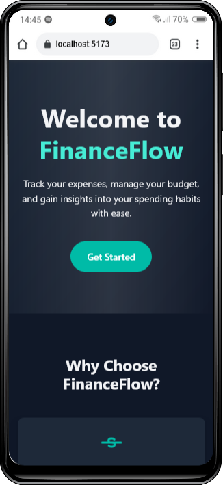
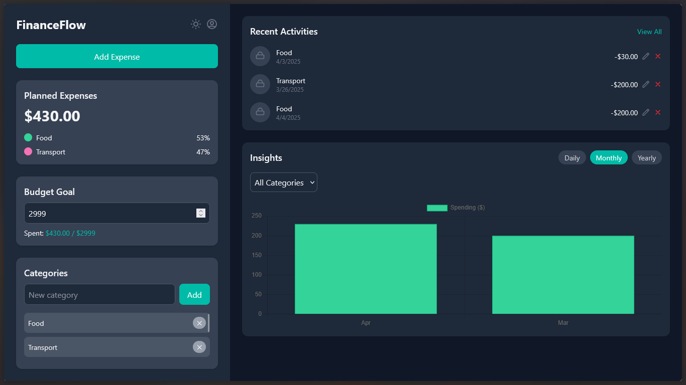
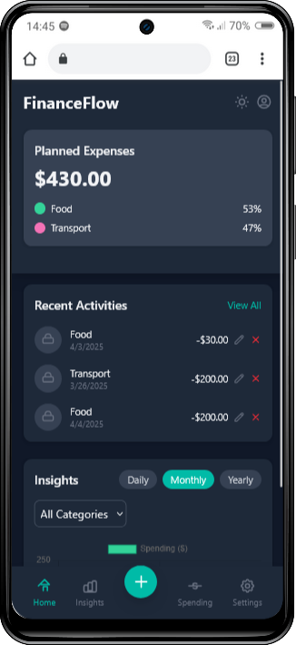

# FinanceFlow - Personal Finance Tracker

**FinanceFlow** is a responsive web application designed to help users track their expenses, manage budgets, and gain insights into their spending habits. With a sleek and modern landing page, interactive dashboard, and powerful features like predictive analytics, FinanceFlow makes personal finance management intuitive and engaging.

---

## Table of Contents

- [Features](#features)
- [Tech Stack](#tech-stack)
- [Installation](#installation)
- [Usage](#usage)
- [Deployment](#deployment)
- [Screenshots](#screenshots)
- [Contributing](#contributing)
- [License](#license)
- [Contact](#contact)

---

## Features

- **Expense Tracking**: Add, edit, and categorize expenses with ease.
- **Budget Management**: Set monthly budget goals and monitor your spending.
- **Spending Insights**: Visualize spending patterns with interactive charts (Pie and Bar charts).
- **Predictive Analytics**: Get predictions for future spending based on historical data.
- **Dark Mode**: Toggle between light and dark themes for a comfortable user experience.
- **Responsive Design**: Fully responsive layout for both desktop and mobile devices.
- **Data Export**: Export your expenses as a CSV file for offline analysis.
- **Modern Landing Page**: A sleek landing page with animations, gradients, and a clear call-to-action.

---

## Tech Stack

- **Frontend**:
  - React.js
  - Tailwind CSS
  - Framer Motion (for animations)
  - Chart.js (for data visualization)
  - React Router (for navigation)
- **Backend**:
  - Node.js
  - Express.js
  - Machine Learning (for spending predictions)
- **Deployment**:
  - Railway (for hosting both frontend and backend)
- **Other Tools**:
  - Axios (for API requests)
  - LocalStorage (for data persistence)
  - Git/GitHub (for version control)

---

## Installation

To run FinanceFlow locally, follow these steps:

1. **Clone the repository**:
   ```bash
   git clone https://github.com/ElderHorror/finance-tracker-frontend.git
   cd finance-tracker
   ```

2. **Install dependencies**:
   ```bash
   npm install
   ```

3. **Start the development server**:
   ```bash
   npm run dev
   ```

4. **Open the app**:
   - The app will be running at `http://localhost:5173/`.

5. **Backend Setup** (if running locally):
   - Clone the backend repository:
     ```bash
     git clone https://github.com/ElderHorror/finance-tracker-backend.git
     cd finance-tracker-backend
     ```
   - Install backend dependencies:
     ```bash
     npm install
     ```
   - Start the backend server:
     ```bash
     npm run dev
     ```
   - The backend will run at `http://localhost:5000` (or the port specified in your backend setup).

---

## Usage

1. **Visit the Landing Page**:
   - Open the app at `http://localhost:5173/` (or the deployed URL).
   - You’ll be greeted with a modern landing page introducing FinanceFlow.

2. **Get Started**:
   - Click the "Get Started" button to navigate to the dashboard at `/app`.

3. **Track Expenses**:
   - Add expenses by selecting a category, entering an amount, and choosing a date.
   - Edit or delete expenses as needed.

4. **Set a Budget**:
   - Set a monthly budget goal and monitor your spending against it.

5. **View Insights**:
   - Use the "Insights" tab to see a breakdown of your spending by category (Pie chart) and over time (Bar chart).
   - Click "Predict Next Week" to get a spending prediction based on your historical data.

6. **Export Data**:
   - Go to the "Spending" tab to filter expenses by date and export them as a CSV file.

7. **Toggle Theme**:
   - Switch between light and dark modes using the theme toggle in the dashboard.

---

## Deployment

The app is deployed on Railway:

- **Frontend**: [https://finance-tracker-frontend-production-7e29.up.railway.app/](https://finance-tracker-frontend-production-7e29.up.railway.app/)
- **Backend**: [https://finance-tracker-backend-production-576f.up.railway.app](https://finance-tracker-backend-production-576f.up.railway.app)

To deploy your own version:

1. **Frontend**:
   - Push your code to a GitHub repository.
   - Connect the repository to Railway and deploy the frontend.
   - Set the build command to `npm run build` and the start command to `npm start`.

2. **Backend**:
   - Push the backend code to a separate GitHub repository.
   - Deploy it on Railway and ensure the frontend is configured to make API requests to the deployed backend URL.

---

## Screenshots

### Landing Page (Desktop)


### Landing Page (Mobile)


### Dashboard (Desktop)


### Dashboard (Mobile)


---

## Contributing

Contributions are welcome! If you’d like to contribute to FinanceFlow, please follow these steps:

1. Fork the repository.
2. Create a new branch:
   ```bash
   git checkout -b feature/your-feature-name
   ```
3. Make your changes and commit them:
   ```bash
   git commit -m "Add your feature description"
   ```
4. Push to your fork:
   ```bash
   git push origin feature/your-feature-name
   ```
5. Open a pull request with a detailed description of your changes.

---

## License

This project is licensed under the MIT License. See the [LICENSE](LICENSE) file for details.

---

## Contact

- **Author**: Adebayo Adedeji
- **GitHub**: [https://github.com/ElderHorror](https://github.com/ElderHorror)
- **Portfolio**: [https://adebayo-adedeji-portfolio.vercel.app](https://adebayo-adedeji-portfolio.vercel.app)
- **Email**: [adebayoadedeji110@gmail.com](mailto:adebayoadedeji110@gmail.com)

Feel free to reach out if you have any questions or suggestions!